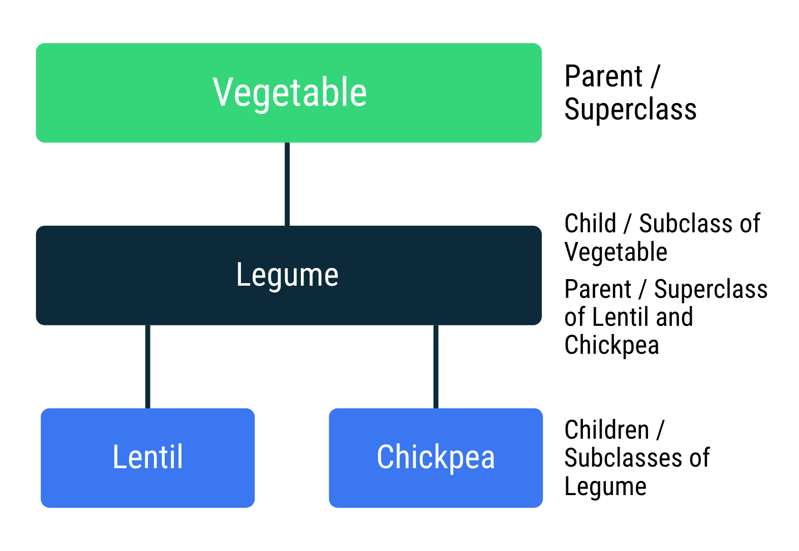
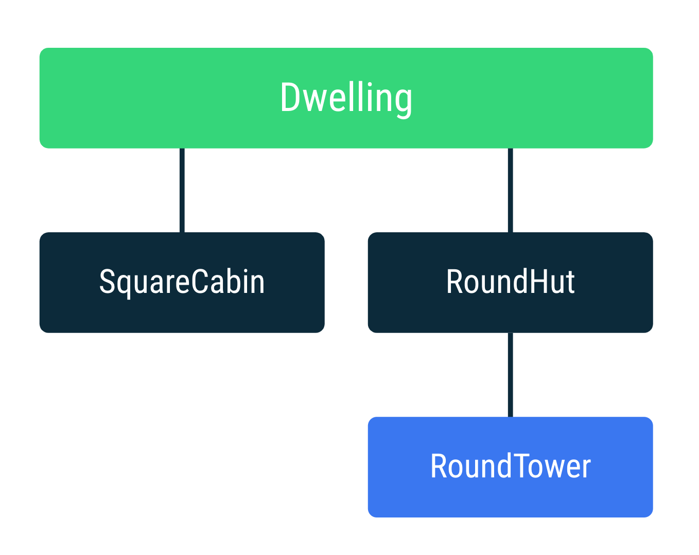

# Class dan Pewarisan di Kotlin
Sumber: [Class dan pewarisan di Kotlin](https://developer.android.com/codelabs/basic-android-kotlin-training-classes-and-inheritance?continue=https%3A%2F%2Fdeveloper.android.com%2Fcourses%2Fpathways%2Fandroid-basics-kotlin-unit-2-pathway-1%23codelab-https%3A%2F%2Fdeveloper.android.com%2Fcodelabs%2Fbasic-android-kotlin-training-classes-and-inheritance#0) dalam codelab [Mendapatkan input pengguna di aplikasi: Bagian 1](https://developer.android.com/courses/pathways/android-basics-kotlin-unit-2-pathway-1)

Wajar bagi manusia untuk mengklasifikasikan item yang memiliki properti dan perilaku serupa ke dalam beberapa grup dan bahkan membentuk beberapa jenis hierarki. Misalnya, Anda dapat memiliki kategori yang luas seperti sayuran, dan di dalamnya Anda dapat memiliki jenis yang lebih spesifik seperti polong-polongan. Di dalam polong-polongan, Anda dapat memiliki jenis yang lebih spesifik seperti kacang polong, kacang, lentil, chick pea, dan kedelai.

Contoh di atas dapat diwakili sebagai hierarki karena polong-polongan mengandung atau mewarisi semua sifat-sifat sayuran (misalnya, tanaman dan dapat dimakan). Demikian pula, kacang polong, kacang, dan lentil juga memiliki sifat polong-polongan ditambah sifat uniknya sendiri.

Mari lihat cara Anda mewakili hubungan ini dalam istilah pemrograman. Jika Anda menjadikan Vegetable sebagai class di Kotlin, Anda dapat membuat Legume sebagai turunan atau subclass dari class Vegetable. Ini berarti semua properti dan metode class Vegetable diwarisi oleh (artinya juga tersedia di) class Legume.

## Hierarki class tempat tinggal
Dalam codelab ini, Anda akan mem-build program Kotlin yang menunjukkan cara kerja hierarki class, menggunakan tempat tinggal (selter hunian) yang dilengkapi ruang lantai, tingkat, dan penghuni sebagai contoh.

Di bawah ini merupakan diagram hierarki class yang akan Anda buat. Di root, Anda memiliki Dwelling yang menentukan properti dan fungsi yang berlaku untuk semua tempat tinggal, mirip dengan cetak biru. Anda juga akan memiliki class untuk kabin persegi (SquareCabin), pondok bundar (RoundHut), dan menara bundar (RoundTower) yang merupakan RoundHut dengan beberapa lantai.

Class yang akan diterapkan:

- Dwelling: class dasar yang mewakili selter non-spesifik yang menyimpan informasi umum untuk semua tempat tinggal.
- SquareCabin: kabin persegi yang terbuat dari kayu dengan area lantai persegi.
- RoundHut: pondok bundar yang terbuat dari jerami dengan area lantai melingkar dan induk RoundTower.
- RoundTower: menara bundar yang terbuat dari batu dengan area lantai melingkar dan beberapa tingkat.

